# Documentación del Proyecto 

## 📋 Descripción General
**ATELIER** es una plataforma de e-commerce especializada en moda6. El proyecto incluye un sistema completo de productos, búsqueda inteligente, y páginas informativas diseñadas para ofrecer una experiencia de usuario excepcional.

---

##  Menús de Navegación: Acceso Rápido y Claro

### **Navegación Principal (Header)**
- **Logo "Atelier"**: Enlace a página de inicio
- **Área de Búsqueda**: Campo con icono de lupa (comportamiento dinámico según página)
- **Controles de Tema**: Botón para alternar modo claro/oscuro
- **Acceso de Usuario**: Botón "Regístrate o inicia sesión"

### **Navegación Secundaria (Footer)**
Organizada en tres columnas:

| Sección | Enlaces |
|---------|---------|
| **Explorar** | Nosotros, Servicios, Ofertas |
| **Ayuda** | Soporte, Envíos, Devoluciones |
| **Legal** | Términos, Privacidad, Cookies |

### **Navegación Contextual por Página**

#### **Página de Productos (`productos2.html`)**
- **Filtros Laterales**: Categoría, Talla, Rango de Precio
- **Ordenación**: Relevancia, Precio, Novedades
- **Paginación**: Navegación entre páginas de productos

#### **Página de Producto Individual (`producto.html`)**
- **Pestañas Informativas**: Detalles, Reseñas, Envío & Devoluciones
- **Navegación Relacionada**: Productos de la misma categoría

---

##  Breadcrumbs: Orientación Contextual

| Página | Ruta de Navegación |
|--------|-------------------|
| **Productos** | Inicio → Productos |
| **Producto Individual** | Inicio → Productos → [Nombre del Producto] |
| **Nosotros** | Inicio → Nosotros |
| **Servicios** | Inicio → Servicios |

**Justificación**: Los breadcrumbs proporcionan contexto espacial dentro del sitio, reduciendo la tasa de abandono y mejorando la experiencia de navegación.

---

##  Páginas de Error: Recuperación ante Fallos

### **Página 404 (`error.html`)**
**Elementos de Recuperación**:
1. **Código de Error Visual**: "404" en tamaño destacado
2. **Mensaje Explicativo**: "Oops! La página que buscas no existe"
3. **Acciones de Recuperación**:
   - Botón principal: "Volver al Inicio"
   - Botón secundario: "Ver Catálogo"
4. **Diseño Consistente**: Mantiene la identidad visual del sitio

**Estrategia de UX**: 
- Mantiene al usuario dentro del sitio web
- Ofrece alternativas relevantes
- Conserva la navegación principal activa

---

##  Selección de Información por Tipo de Página

### **1. Página de Inicio (`index.html`)**
| Elemento | Justificación |
|----------|---------------|
| **Hero Section con Ofertas** | Capta atención inmediata, comunica valor |
| **Trust Badges** | Construye confianza (envío gratis, seguridad) |
| **Productos Destacados** | Muestra lo mejor del catálogo, impulsa ventas |
| **Newsletter CTA** | Captura leads para marketing futuro |
| **Call-to-Action Principal** | Guía hacia la conversión (explorar productos) |

### **2. Página "Nosotros" (`nosotros.html`)**
| Elemento | Justificación |
|----------|---------------|
| **Historia de la Marca** | Crea conexión emocional, establece credibilidad |
| **Misión y Valores** | Comunica propósito, atrae clientes afines |
| **Equipo de Trabajo** | Humaniza la marca, muestra expertise |
| **Valores Fundamentales** | Transparencia sobre principios de operación |
| **CTA hacia Productos** | Convierte interés en acción comercial |

### **3. Página "Servicios" (`servicios.html`)**
| Elemento | Justificación |
|----------|---------------|
| **Servicios Principales** | Personal Styling, Envío Premium |
| **Servicios Adicionales** | Cambios, Soporte VIP, Eventos |
| **Beneficios Detallados** | Explica valor más allá del producto |
| **Newsletter Exclusiva** | Fidelización mediante contenido premium |

---

##  Jerarquización de Contenidos

### **Nivel 1: Información Principal**
```
┌─────────────────────────────────────┐
│         ATELIER - E-commerce        │
├─────────────────────────────────────┤
│ 1. Catálogo de Productos            │
│ 2. Sistema de Búsqueda Inteligente  │
│ 3. Información de Compra (precios)  │
│ 4. Proceso de Checkout              │
└─────────────────────────────────────┘
```

### **Nivel 2: Información Secundaria**
```
┌─────────────────────────────────────┐
│         Soporte de Decisión         │
├─────────────────────────────────────┤
│ 1. Detalles de Productos            │
│ 2. Reseñas y Valoraciones           │
│ 3. Políticas (envío, devoluciones)  │
│ 4. Información de la Empresa        │
└─────────────────────────────────────┘
```

### **Nivel 3: Información Complementaria**
```
┌─────────────────────────────────────┐
│       Contexto y Fidelización       │
├─────────────────────────────────────┤
│ 1. Historia de la Marca             │
│ 2. Servicios Adicionales            │
│ 3. Contenido Educativo (estilo)     │
│ 4. Newsletter y Ofertas Exclusivas  │
└─────────────────────────────────────┘
```

---

##  Redacción WEB Profesional

### **Sección 1: Hero Section (Página de Inicio)**
```
Título Principal: "Todo lo que Necesitas"

Subtítulo: "Miles de productos en un solo lugar"

Párrafo Introductorio:
"Ofertas increíbles, envío gratis y la mejor calidad.
Descubre piezas únicas que transformarán tu estilo
y elevarán tu confianza cada día."

Lista de Beneficios:
✓ Envío gratis en pedidos +$50
✓ Compra 100% segura con garantía
✓ Devoluciones fáciles en 30 días
✓ Soporte personalizado 24/7
```

### **Sección 2: Servicio de Personal Styling**
```
Título Atractivo: "Personal Styling: Tu Estilo, Nuestra Pasión"

Subtítulo Descriptivo: 
"Diseñamos looks que celebran tu individualidad"

Párrafos Cortos:
"Nuestros expertos en estilo analizan tu personalidad,
tonalidad y preferencias para crear combinaciones
perfectas que resalten lo mejor de ti.

Cada sesión incluye análisis de colorimetría,
curaduría de guardarropa y recomendaciones
personalizadas basadas en tendencias actuales."

Lista de Características:
• Sesiones online o presenciales
• Reporte de estilo personalizado
• Recomendaciones por temporada
• Acceso a piezas exclusivas
```

**Principios Aplicados**:
- **Títulos claros** que comunican valor inmediato
- **Subtítulos guía** que estructuran la información
- **Párrafos breves** (2-3 líneas) para fácil escaneo
- **Listas visuales** para información procesable
- **Lenguaje profesional** pero accesible

---

## Diseño del Sistema de Búsqueda

### **Definición de Alcance**
El sistema de búsqueda estará enfocado en facilitar al usuario la localización rápida y eficiente del contenido más relevante dentro del sitio web de e-commerce Atelier.
El contenido que será indexado y buscable incluye:

- **Productos:** nombre del producto, descripción, categoría, precio y etiquetas asociadas.

- **Categorías de productos:** como ropa, accesorios y calzado.

- **Contenido textual principal:** títulos, descripciones y palabras clave relacionadas con moda y estilo.

- **Secciones informativas relevantes:** como ofertas y productos destacados.

La prioridad del sistema de búsqueda está centrada en los productos, ya que representan el principal interés del usuario. La búsqueda permitirá encontrar artículos específicos o explorar productos relacionados mediante palabras clave, mejorando la experiencia de compra y reduciendo el tiempo de navegación.
| Contenido Indexado | Prioridad | Justificación |
|-------------------|-----------|---------------|
| **Nombres de Productos** | Alta | Búsqueda directa por artículo |
| **Categorías** | Alta | Navegación por tipo de producto |
| **Descripciones** | Media | Búsqueda por características |
| **Tags/Etiquetas** | Media | Búsqueda por estilo o ocasión |
| **Materiales** | Baja | Búsqueda avanzada por composición |
| **Contenido Informativo** | Baja | "Nosotros", "Servicios" |

### **Interfaz de Búsqueda**
#### **Diseñar Interfaz**

La interfaz del sistema de búsqueda ha sido diseñada para ser intuitiva, visible y accesible.
Los elementos principales son:

- **Campo de texto de búsqueda:** permite al usuario ingresar palabras clave relacionadas con productos.
- **Ícono de búsqueda:** refuerza visualmente la función del campo.

- **Área de resultados:** muestra dinámicamente los productos que coinciden con la búsqueda y los filtros aplicados.

La ubicación del buscador es estratégica, ya que se encuentra en el encabezado del sitio, permitiendo que esté disponible en todo momento durante la navegación. Esto facilita el acceso inmediato a la búsqueda sin importar la sección en la que se encuentre el usuario.

#### **Wireframe de Búsqueda Básica**
```
┌─────────────────────────────────────────────────────────────────┐
│                           ATELIER HEADER                        │
├─────────────────────────────────────────────────────────────────┤
│  ┌─────────────────────────────────────────────────────────┐    │
│  │                  ┌─────────────────────────────┐        │    │
│  │  [LOGO]          │  🔍 Buscar productos...     │  [👤] │    │
│  │                  └─────────────────────────────┘        │    │
│  └─────────────────────────────────────────────────────────┘    │
└─────────────────────────────────────────────────────────────────┘
```

#### **Wireframe de Resultados + Filtros**
```
┌────────────────────────────────────────────────────────────────────┐
│ RESULTADOS: "vestido elegante" (24 productos encontrados)          │
│ ┌─────────────────────────────────────────────────────────────┐    │
│ │ Mostrando 1-12 de 24 productos    [Ordenar por: Relevancia]↓│    │
│ └─────────────────────────────────────────────────────────────┘    │
├──────────────────┬─────────────────────────────────────────────────┤
│                  │ ┌─────┐ ┌─────┐ ┌─────┐ ┌─────┐                 │
│ ┌─────────────┐  │ │     │ │     │ │     │ │     │                 │
│ │ FILTROS     │  │ └─────┘ └─────┘ └─────┘ └─────┘                 │
│ │             │  │                                                 │
│ │ Categoría   │  │   ┌─────┐ ┌─────┐ ┌─────┐ ┌─────┐               │
│ │  ▢ Vestidos │  │  │     │ │     │ │     │ │     │                │
│ │  ▢ Chaquetas│  │  └─────┘ └─────┘ └─────┘ └─────┘                │
│ │             │  │                                                 │
│ │ Talla       │  │  ← 1 2 3 ... →        [12 productos/página]     │
│ │  [S][M][L]  │  │                                                 │
│ │             │  │                                                 │
│ │ Precio      │  │                                                 │
│ │ $0────$500  │  │                                                 │
│ │             │  │                                                 │
│ └─────────────┘  │                                                 │
└──────────────────┴─────────────────────────────────────────────────┘
```

### **Ubicación Estratégica**
1. **Header Principal**: Acceso inmediato desde cualquier página
2. **Página Dedicada** (`productos2.html`): Búsqueda avanzada con filtros
3. **Comportamiento Adaptativo**: 
   - Páginas comerciales → Buscador completo
   - Páginas informativas → Icono que redirige a página de búsqueda

### **Planificación de Filtros**
El sistema de búsqueda incluye una búsqueda avanzada mediante filtros, los cuales permiten refinar los resultados de forma lógica y precisa. Los filtros implementados son:

- **Categoría:** permite seleccionar uno o varios tipos de productos.

- **Talla:** filtra los productos según las tallas disponibles.

- **Rango de precio:** limita los resultados según un precio máximo definido por el usuario.

- **Ordenación:** permite ordenar los resultados por relevancia, precio o novedades.

Estos filtros funcionan de manera combinada con las palabras clave ingresadas en el buscador.
Por ejemplo, un usuario puede buscar “chaqueta” y al mismo tiempo seleccionar una categoría y un rango de precio, obteniendo resultados más específicos y relevantes.

La estructura de los filtros está pensada para ser clara y fácil de usar, permitiendo activar o desactivar opciones sin recargar la página, lo que mejora el rendimiento y la experiencia general del usuario.

#### **Estructura Jerárquica de Filtros**
```
BÚSQUEDA PRINCIPAL
├── Categoría (Primer Nivel)
│   ├── Vestidos
│   ├── Chaquetas
│   ├── Camisetas
│   └── Pantalones
├── Subcategoría (Segundo Nivel)
│   ├── Vestidos de ocasión
│   ├── Vestidos midi
│   └── Conjuntos
├── Atributos de Producto
│   ├── Tallas (S, M, L, XL)
│   ├── Rango de Precio ($0 - $1000)
│   ├── Color
│   └── Material
└── Estado del Producto
    ├── En oferta
    ├── Nuevo
    ├── Destacado
    └── En stock
```

#### **Algoritmo de Relevancia**
1. **Coincidencia Exacta** en nombre de producto
2. **Filtros Aplicados** por usuario
3. **Ordenamiento** por:
   - Relevancia de búsqueda
   - Destacados primero
   - Precio (configurable)
   - Novedades

---

##  Consideraciones Técnicas y UX

### **Patrones de Implementación**
1. **Búsqueda en Tiempo Real**: Suggestions mientras se escribe
2. **Resultados Paginados**: 12 productos por página
3. **Estado Persistente**: Filtros mantienen selección entre navegaciones

### **Accesibilidad**
- **ARIA labels** en campos de búsqueda
- **Navegación por teclado** en resultados
- **Contraste adecuado** en todos los estados
- **Texto alternativo** para imágenes de productos

### **Performance**
- **Lazy loading** de imágenes de productos
- **Debouncing** en búsqueda en tiempo real
- **Paginación progresiva** para grandes conjuntos

---
##  Pruebas de usabilidad
### **Visibilidad del Buscador**
Comprobar que el buscador sea fácil de encontrar y usar desde cualquier página.

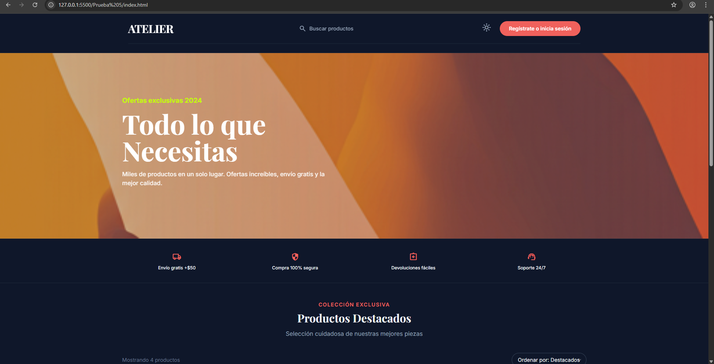

Está visible sin necesidad de hacer scroll. El buscador es claramente visible en la parte superior, en el centro de la pantalla; es un boton que redirige a la pagina de productos. 

---
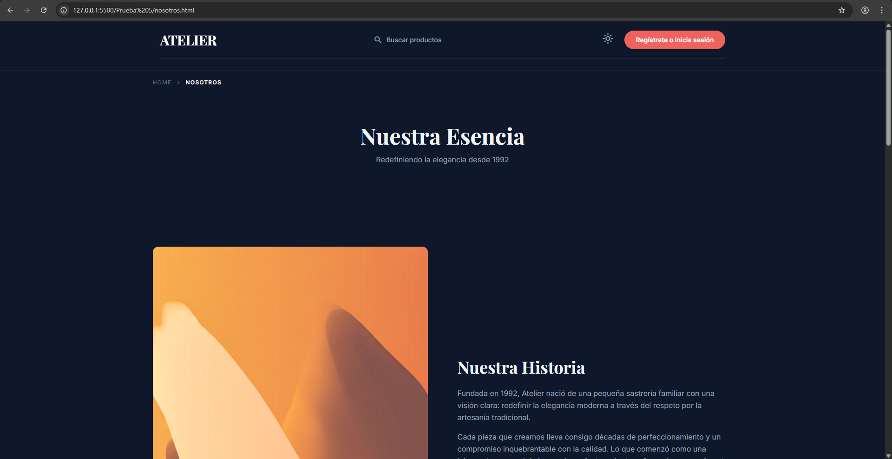 

Está visible sin necesidad de hacer scroll. El buscador es claramente visible en la parte superior, en el centro de la pantalla; es un boton que redirige a la pagina de productos. 

---
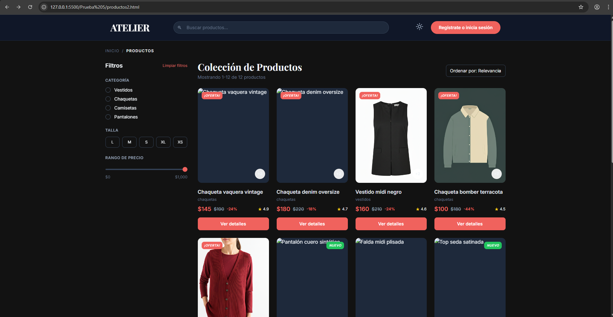 

Está visible sin necesidad de hacer scroll. El buscador es claramente visible en la parte superior, en el centro de la pantalla; es un buscador funcional que permite realizar buequedas con palabras similares, sin faltas de ortografias. 

---
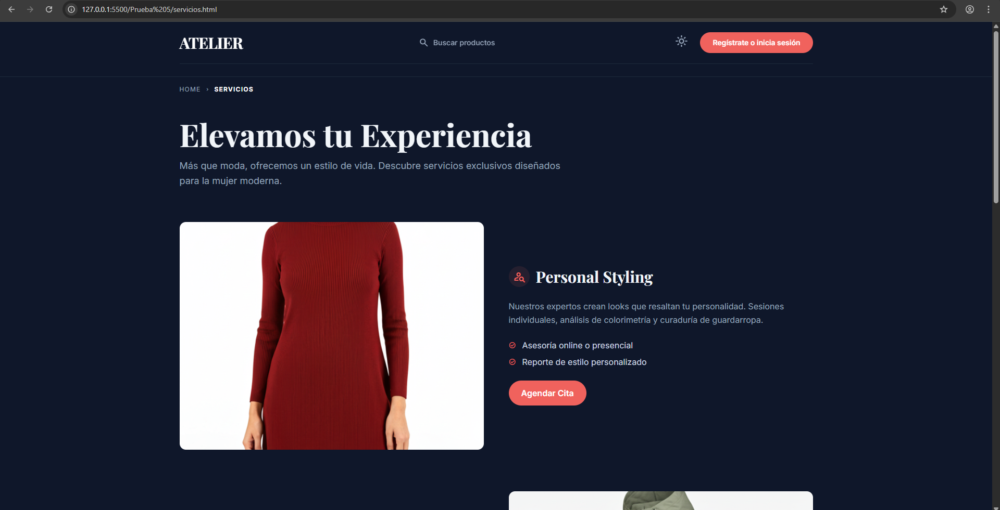 

Está visible sin necesidad de hacer scroll. El buscador es claramente visible en la parte superior, en el centro de la pantalla; es un boton que redirige a la pagina de productos. 

---

### **Claridad de Resultados**
Verificar que los resultados de búsqueda sean claros y comprensibles.
Esta página muestra el catálogo de productos del sitio web Atelier y está pensada para que el usuario pueda encontrar ropa de forma rápida y sencilla.

En la parte superior se encuentra el logo de la tienda, un buscador donde se pueden escribir palabras clave para localizar productos, y un botón para registrarse o iniciar sesión. Justo debajo aparece una pequeña guía de navegación que indica en qué sección del sitio se encuentra el usuario (Inicio / Productos).

Del lado izquierdo se muestran los filtros, los cuales ayudan a reducir los resultados según lo que el usuario esté buscando. Aquí se pueden elegir categorías como vestidos, chaquetas o pantalones, seleccionar la talla y ajustar un rango de precio. También hay una opción para limpiar los filtros y volver a ver todos los productos.

En la parte central se presenta la lista de productos, organizada en tarjetas. Cada tarjeta incluye una imagen del producto, su nombre, categoría, precio, descuentos, calificación y un botón de “Ver detalles”. Algunos productos cuentan con etiquetas como “Oferta” o “Nuevo” para destacar promociones o artículos recientes.

Además, en la parte superior derecha se puede ordenar los productos por relevancia, lo que facilita encontrar primero lo más importante. En general, la página es clara, ordenada y fácil de usar, permitiendo que el usuario navegue cómodamente y encuentre lo que busca sin complicaciones.

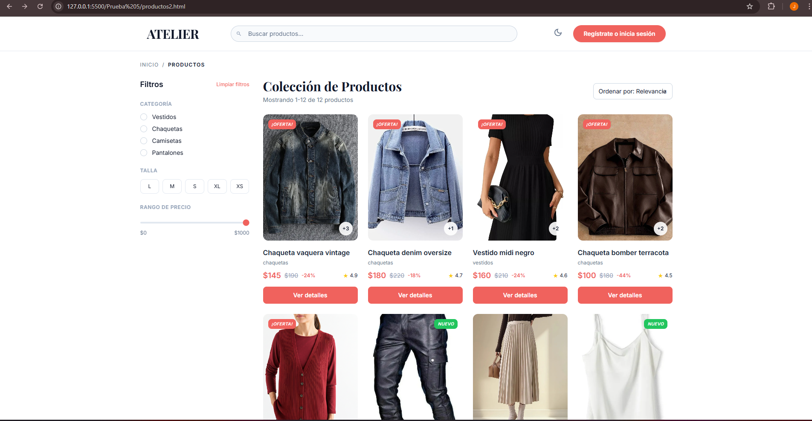

---
Al escribir solo dos letras en el buscador, el sistema reconoce coincidencias parciales y muestra productos relacionados de manera inmediata, manteniendo claridad y orden en los resultados.

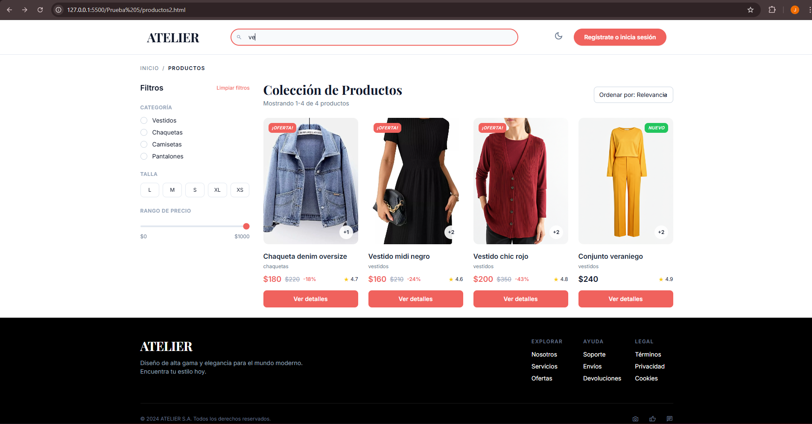

---
Al ingresar una palabra sin la ortografía correcta, el sistema no encuentra coincidencias. Al corregir la palabra y usar acentos adecuados, los resultados se muestran correctamente.

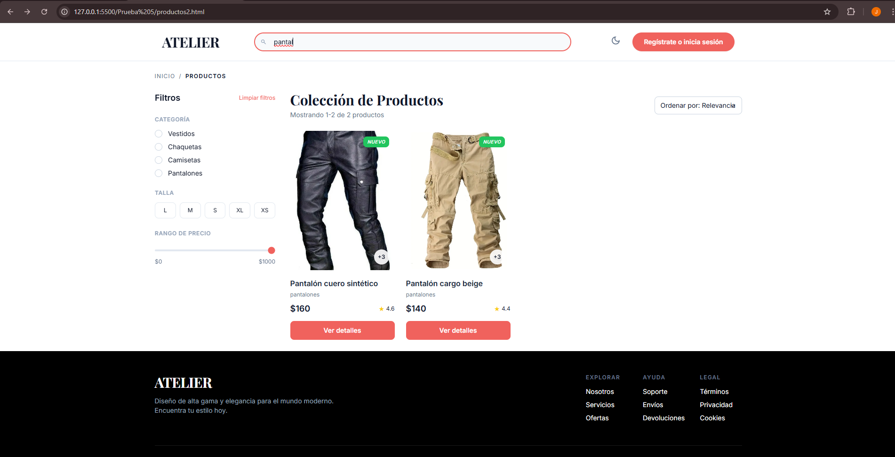

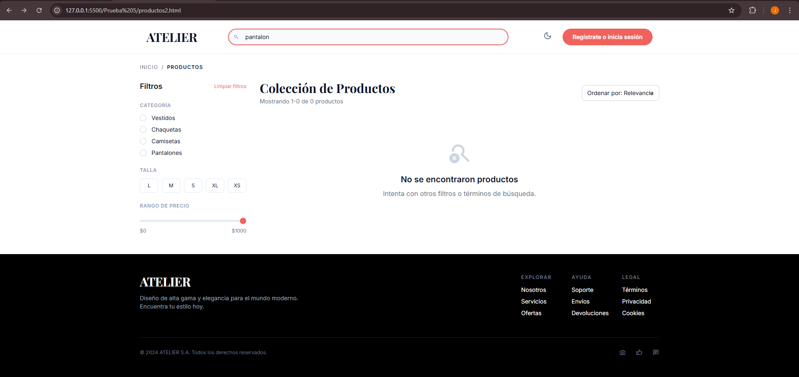

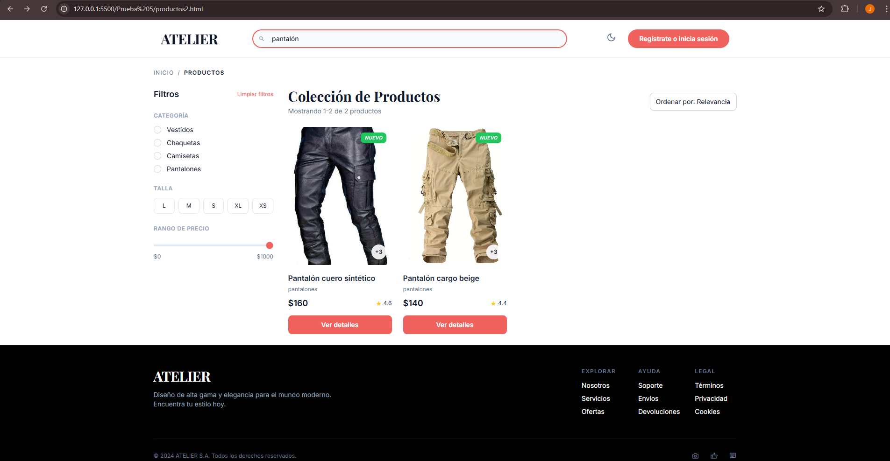

---
**Filtro por categoría**
Al seleccionar una categoría específica desde el panel de filtros, el sistema actualiza automáticamente la lista de productos para mostrar únicamente aquellos que pertenecen a la categoría elegida.
Por ejemplo, al seleccionar la categoría “Vestidos”, el catálogo se reduce y solo se muestran productos relacionados con dicha categoría.

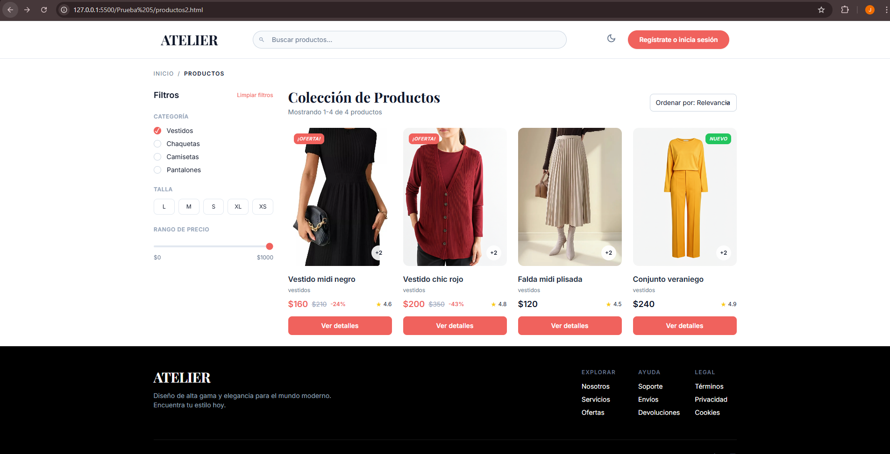

---
El filtro permite seleccionar varias categorías a la vez, mostrando productos que coinciden con cualquiera de las categorías elegidas.

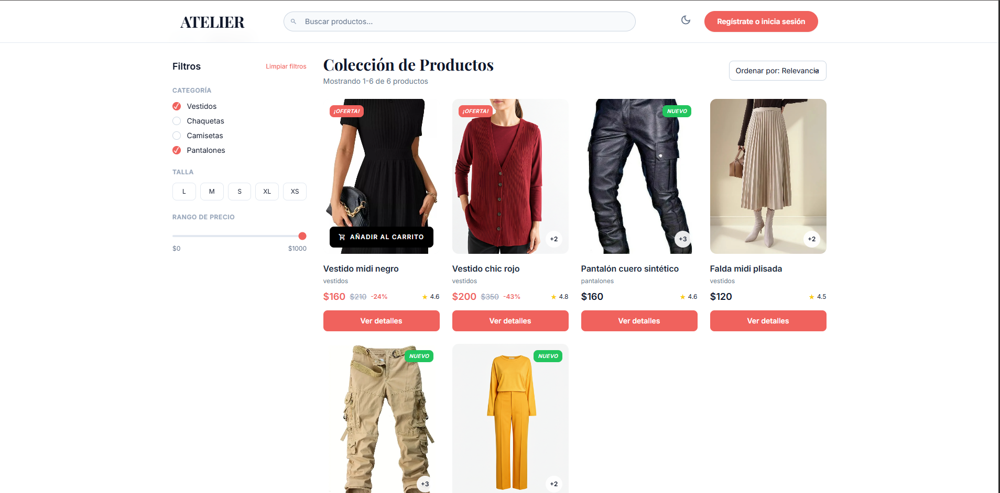

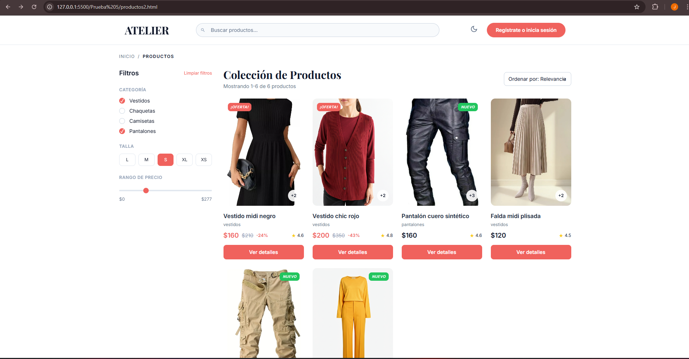

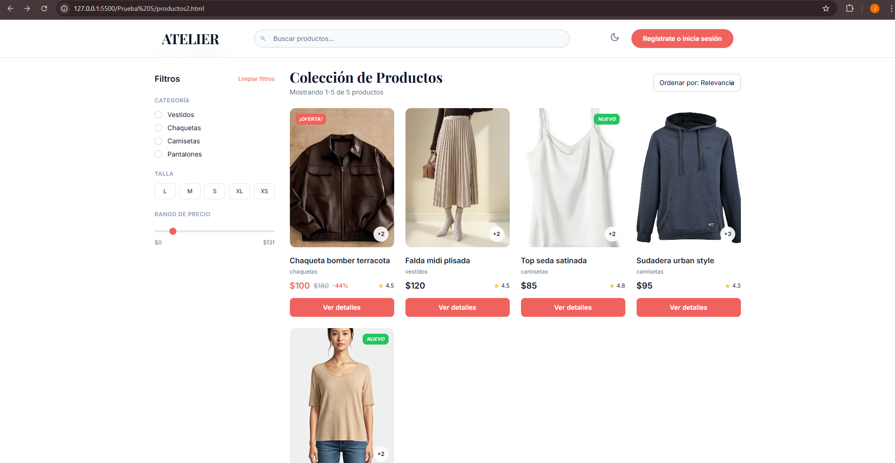

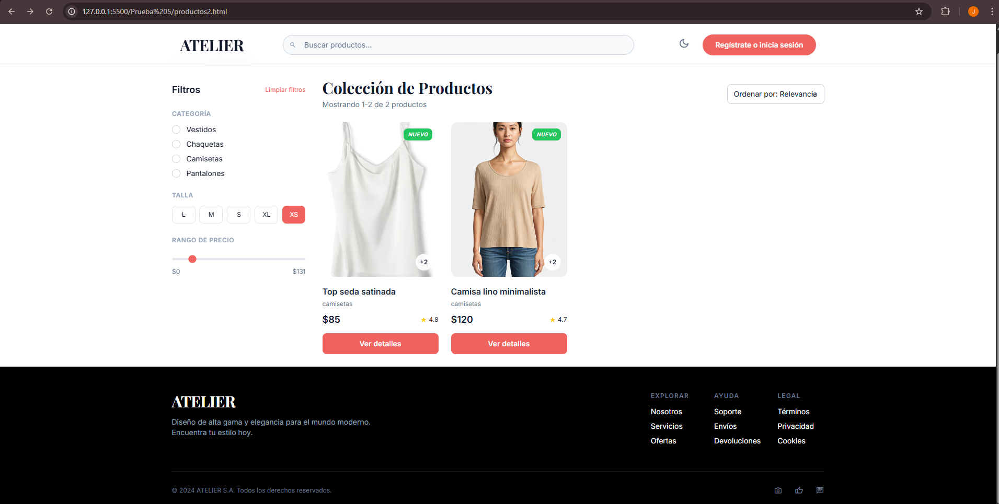

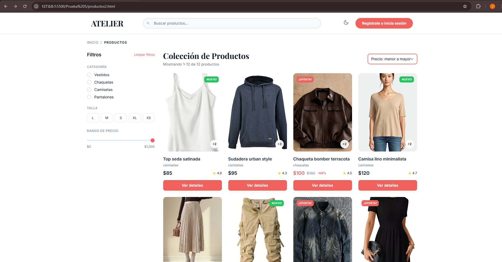


---

# VALIDACIONES 

## WIREFRAMES

Se utilizan para asegurar que el usuario proporciona toda la información necesaria para crear una cuenta funcional.

┌────────────────────────────────────────────────────────────────────┐
│ ATELIER                                   [🌓] [¿Ya tienes cuenta?]│
├────────────────────────────────────────────────────────────────────┤
│                                                                    │
│                      CREAR CUENTA                                   │
│                 Únete a la comunidad ATELIER                       │
│                                                                    │
│  ┌────────────────────────────────────────────────────────────┐   │
│  │ Nombre(s) *                                                │   │
│  │ ┌────────────────────────────────────────────────────────┐ │   │
│  │ │ María Elena                                            │ │   │
│  │ └────────────────────────────────────────────────────────┘ │   │
│  │   ──────────────────────────────────────────────────────── │   │
│  └────────────────────────────────────────────────────────────┘   │
│                                                                   │
│  ┌────────────────────────────────────────────────────────────┐   │
│  │ Apellido(s) *                                              │   │
│  │ ┌────────────────────────────────────────────────────────┐ │   │
│  │ │ Rodríguez López                                        │ │   │
│  │ └────────────────────────────────────────────────────────┘ │   │
│  │   ──────────────────────────────────────────────────────── │   │
│  └────────────────────────────────────────────────────────────┘   │
│                                                                   │
│  ┌────────────────────────────────────────────────────────────┐   │
│  │ Correo electrónico *                                       │   │
│  │ ┌────────────────────────────────────────────────────────┐ │   │
│  │ │ tucorreo@ejemplo.com                                   │ │   │
│  │ └────────────────────────────────────────────────────────┘ │   │
│  │   ──────────────────────────────────────────────────────── │   │
│  └────────────────────────────────────────────────────────────┘   │
│                                                                   │
│  ┌────────────────────────────────────────────────────────────┐   │
│  │ Teléfono *                                                 │   │
│  │ ┌────────────────────────────────────────────────────────┐ │   │
│  │ │ 3001234567                                             │ │   │
│  │ └────────────────────────────────────────────────────────┘ │   │
│  │   ──────────────────────────────────────────────────────── │   │
│  └────────────────────────────────────────────────────────────┘   │
│                                                                   │
│  ┌────────────────────────────────────────────────────────────┐   │
│  │ Contraseña *                                        [👁️]  │   │
│  │ ┌────────────────────────────────────────────────────────┐ │   │
│  │ │ ••••••••                                               │ │   │
│  │ └────────────────────────────────────────────────────────┘ │   │
│  │                                                            │   │
│  │ [████____________________________________]                 │   │
│  │ Seguridad: Débil                                           │   │
│  │                                                            │   │
│  │ ✓ Al menos 8 caracteres                                    │   │
│  │ ✓ Al menos una mayúscula                                   │   │
│  │ ✓ Al menos un número                                       │   │
│  │ ✓ Al menos un carácter especial                            │   │
│  │   ────────────────────────────────────────────────────────  │   │
│  └────────────────────────────────────────────────────────────┘   │
│                                                                    │
│  ┌────────────────────────────────────────────────────────────┐   │
│  │ Confirmar contraseña *                              [👁️]   │   │
│  │ ┌────────────────────────────────────────────────────────┐ │   │
│  │ │ ••••••••                                               │ │   │
│  │ └────────────────────────────────────────────────────────┘ │   │
│  │   ────────────────────────────────────────────────────────  │   │
│  └────────────────────────────────────────────────────────────┘   │
│                                                                    │
│  ┌────────────────────────────────────────────────────────────┐   │
│  │ Verificación de seguridad *                                 │   │
│  │ ┌────────────────────────────────────────────────────────┐ │   │
│  │ │ Marque la casilla para confirmar que no es un robot  [⬜]│ │   │
│  │ └────────────────────────────────────────────────────────┘ │   │
│  │   ────────────────────────────────────────────────────────  │   │
│  └────────────────────────────────────────────────────────────┘   │
│                                                                    │
│  ┌────────────────────────────────────────────────────────────┐   │
│  │ [⬜] Acepto los Términos y Condiciones *                   │   │
│  │   ────────────────────────────────────────────────────────  │   │
│  └────────────────────────────────────────────────────────────┘   │
│                                                                    │
│  ┌────────────────────────────────────────────────────────────┐   │
│  │ [⬜] He leído y acepto el Aviso de Privacidad              │   │
│  │   ────────────────────────────────────────────────────────  │   │
│  └────────────────────────────────────────────────────────────┘   │
│                                                                    │
│  ┌────────────────────────────────────────────────────────────┐   │
│  │ [          CREAR CUENTA (deshabilitado)           ]        │   │
│  └────────────────────────────────────────────────────────────┘   │
│  │   Por favor, completa todos los campos correctamente         │   │
│                                                                    │
│  ┌────────────────────────────────────────────────────────────┐   │
│  │ ¿Ya tienes una cuenta? Inicia sesión aquí                  │   │
│  └────────────────────────────────────────────────────────────┘   │
│                                                                    │
├────────────────────────────────────────────────────────────────────┤
│                    © 2024 ATELIER S.A.                             │
└────────────────────────────────────────────────────────────────────┘


---

## 1. ¿POR QUÉ SE UTILIZAN ESTAS VALIDACIONES?

### Validaciones de Registro

**Campos obligatorios**
Se utilizan para asegurar que el usuario proporciona toda la información necesaria para crear una cuenta funcional.

**Longitud mínima y máxima**
Se implementan para prevenir datos demasiado cortos que serían inválidos, y datos demasiado largos que podrían usarse en ataques de desbordamiento.

**Solo letras en nombres**
Se aplica para evitar caracteres especiales o números en campos de nombre, que no tienen sentido en un nombre propio.

**Formato email**
Se utiliza para garantizar que el email tenga estructura válida de usuario@dominio.com, evitando errores de tipeo obvios.

**Formato teléfono**
Se implementa para asegurar que el número tenga la cantidad de dígitos suficiente para ser un teléfono válido.

**Fortaleza de contraseña**
El mínimo de 8 caracteres asegura una dificultad básica contra ataques. La combinación de mayúscula, número y carácter especial aumenta la complejidad contra ataques de fuerza bruta y diccionario.

**Coincidencia contraseñas**
Se utiliza para evitar errores de tipeo en la contraseña, asegurando que el usuario escribió correctamente lo que quería como clave.

**Verificación humana**
Se implementa para diferenciar usuarios reales de bots automatizados que podrían crear cuentas falsas masivamente.

**Términos y condiciones**
Se requiere para asegurar la aceptación legal antes de crear la cuenta, protegiendo legalmente a la empresa.

### Validaciones de Login

**Email obligatorio**
El email funciona como identificador único del usuario, por lo que es necesario para saber quién intenta acceder.

**Formato email**
Se utiliza para prevenir errores de tipeo obvios que impedirían encontrar al usuario en el sistema.

**Contraseña obligatoria**
Es la credencial de seguridad que valida que quien ingresa el email es el dueño de la cuenta.

**Usuario único**
Se implementa un solo usuario demo para simplificar las pruebas, evitando la complejidad de una base de datos.

**reCAPTCHA**
Se utiliza para prevenir ataques automatizados de bots que intenten adivinar contraseñas por fuerza bruta. También protege contra spam y ataques de denegación de servicio.

---

## 2. VALIDACIONES IMPLEMENTADAS

### A. REGISTRO (registro.html)

**Nombre(s)**
Se aplican validaciones de campo obligatorio, mínimo 2 caracteres, máximo 40 caracteres y solo letras y espacios. Los mensajes de error son "Este campo es obligatorio", "Mínimo 2 caracteres", "Máximo 40 caracteres" y "Solo letras y espacios".

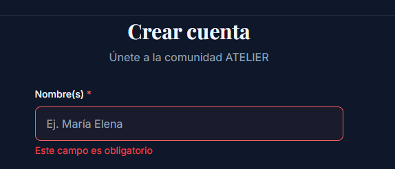
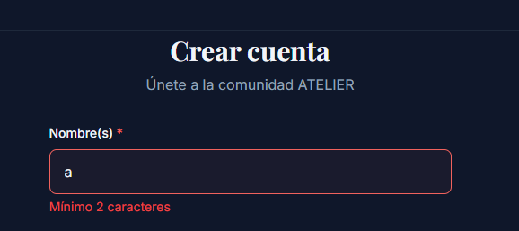
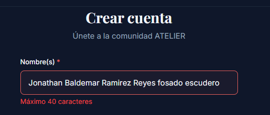
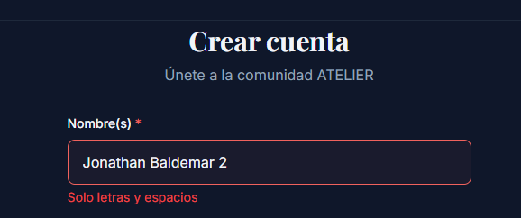

**Apellido(s)**
Se aplican validaciones de campo obligatorio, mínimo 2 caracteres, máximo 40 caracteres y solo letras y espacios. Los mensajes de error son "Este campo es obligatorio", "Mínimo 2 caracteres", "Máximo 40 caracteres" y "Solo letras y espacios".

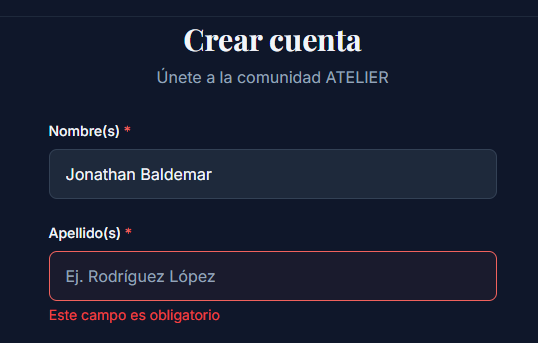
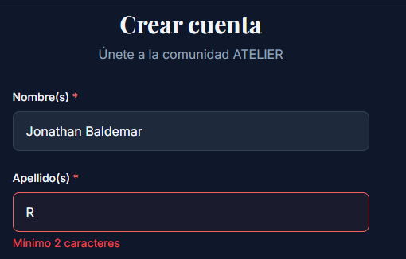
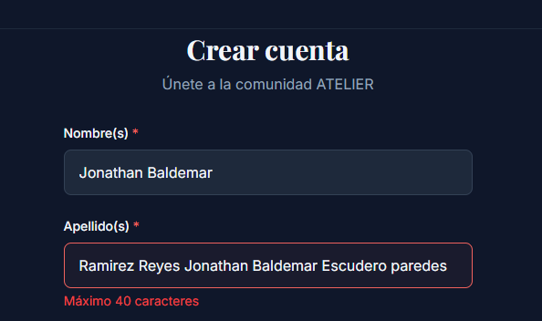
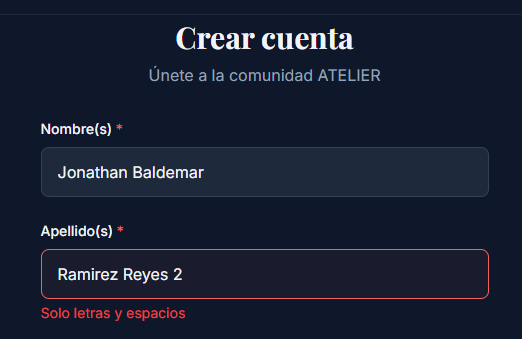

**Email**
Se aplican validaciones de campo obligatorio, formato email válido y máximo 500caracteres. Los mensajes de error son "Este campo es obligatorio", "Ingresa un email válido" y "Máximo 50 caracteres".

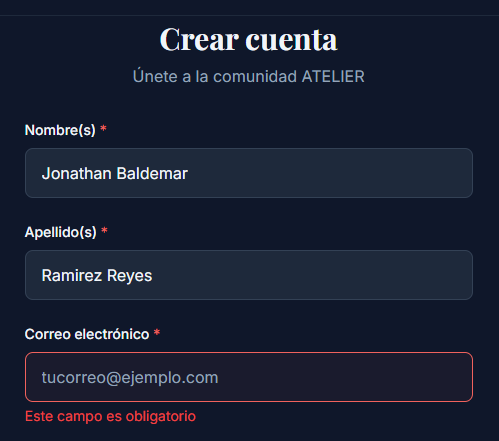
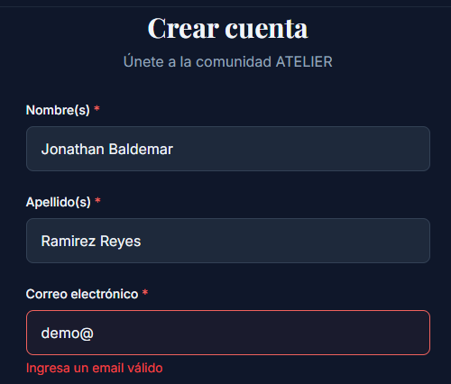
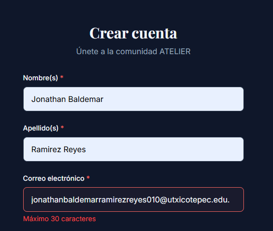

**Teléfono**
Se aplican validaciones de campo obligatorio, mínimo 10 dígitos y máximo 15 dígitos. Los mensajes de error son "Este campo es obligatorio", "Debe tener al menos 10 dígitos", "Máximo 15 dígitos" y "Solo se permiten numeros".

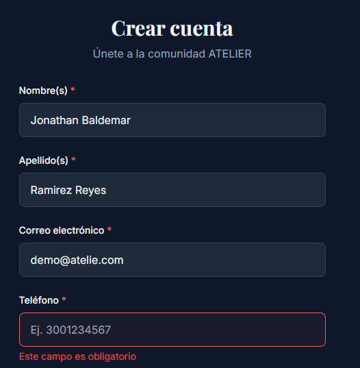
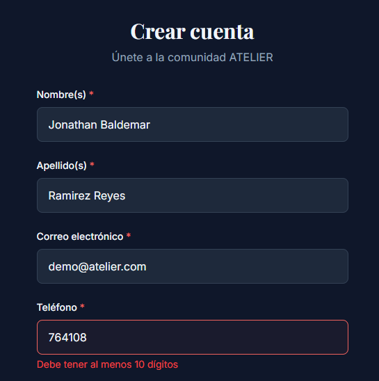
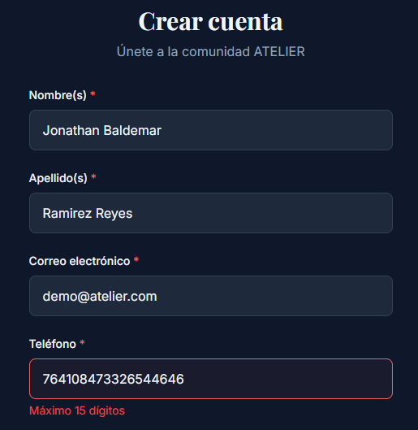
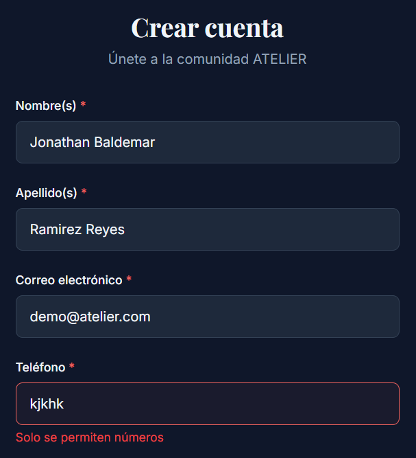

**Contraseña**
Se aplican validaciones de campo obligatorio, mínimo 8 caracteres, máximo 15 caracteres, al menos una mayúscula, al menos un número y al menos un carácter especial. Los mensajes de error son "Mínimo 8 caracteres", "Al menos una mayúscula", "Al menos un número" y "Al menos un carácter especial".

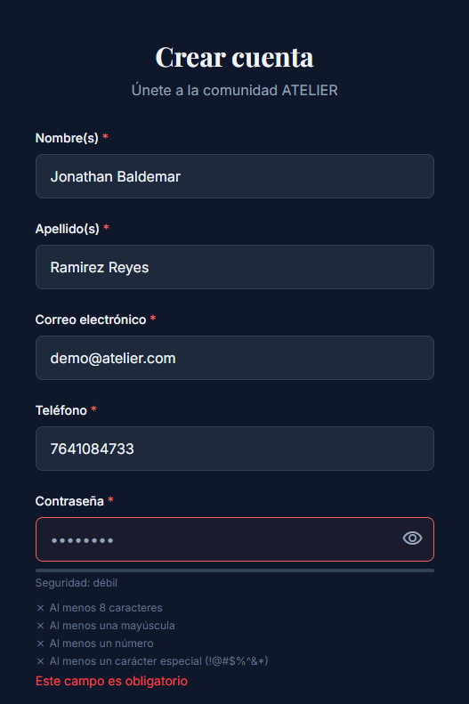
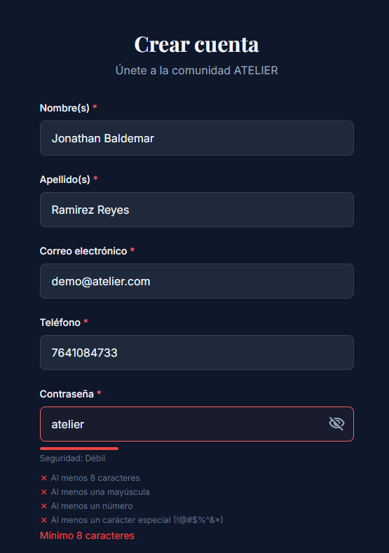
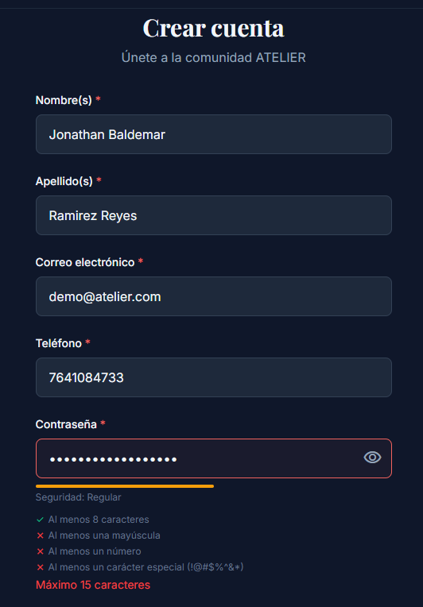

**Confirmar Contraseña**
Se aplican validaciones de campo obligatorio y que coincida con la contraseña ingresada. El mensaje de error es "Las contraseñas no coinciden".

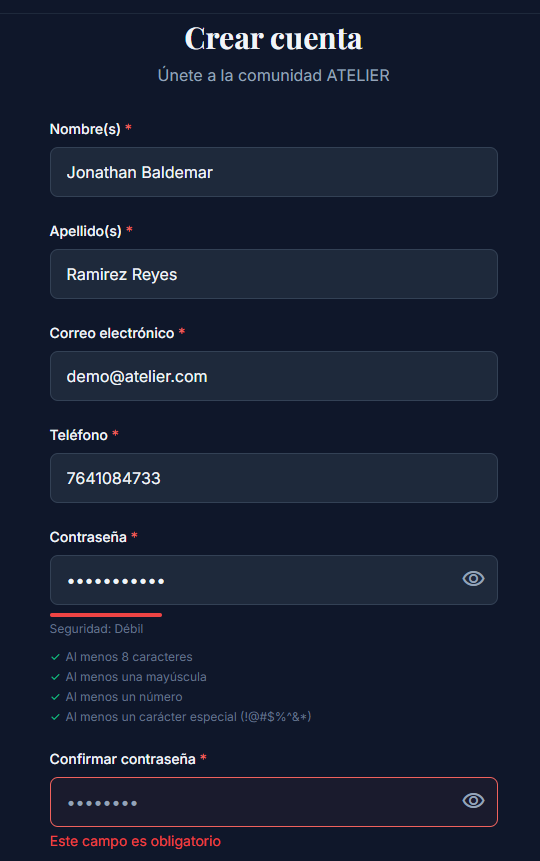
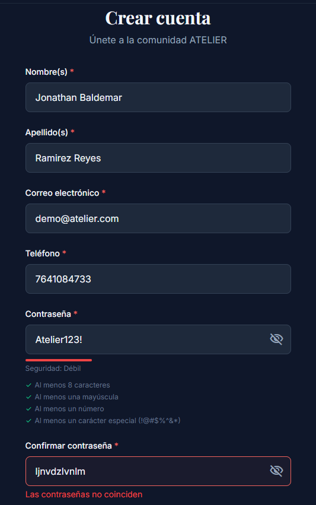

**Verificación Humana**
Se aplica validación de checkbox marcado. El mensaje de error es "Debes confirmar que no eres un robot".

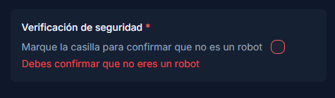

**Términos y Condiciones**
Se aplica validación de checkbox marcado. El mensaje de error es "Debes aceptar los términos y condiciones".

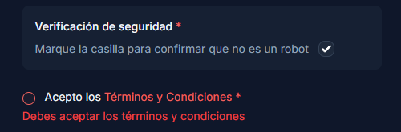

### B. LOGIN (login.html)

**Email**
Se aplican validaciones de campo obligatorio y formato email válido. Los mensajes de error son "Por favor, ingresa tu correo electrónico" e "Ingresa un email válido".

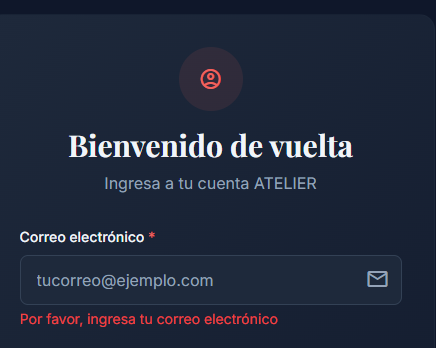
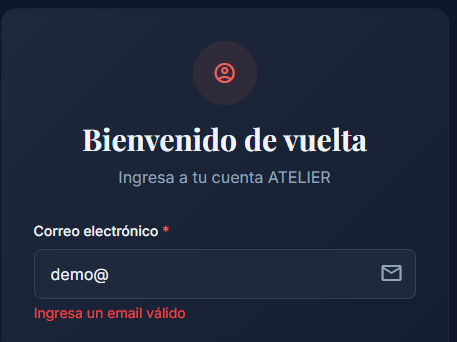

**Contraseña**
Se aplica validación de campo obligatorio. El mensaje de error es "Por favor, ingresa tu contraseña".

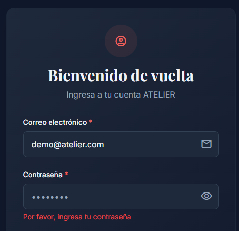

**Credenciales**
Se valida que el email sea demo@atelier.com y la contraseña sea Atelier123!. El mensaje de error es "Email o contraseña incorrectos".

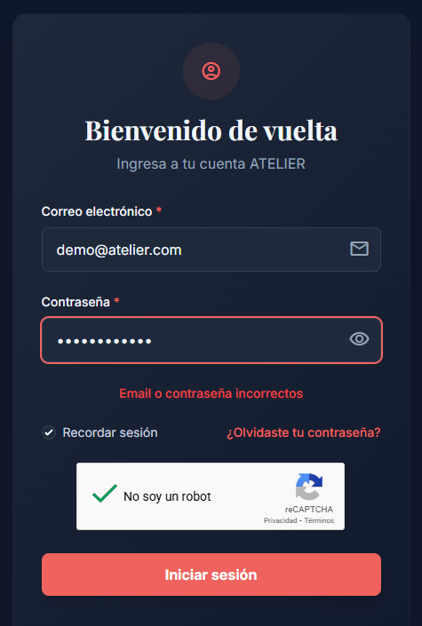

**reCAPTCHA**
Se valida que la verificación esté completada. El mensaje de error es "Por favor, completa la verificación de seguridad".

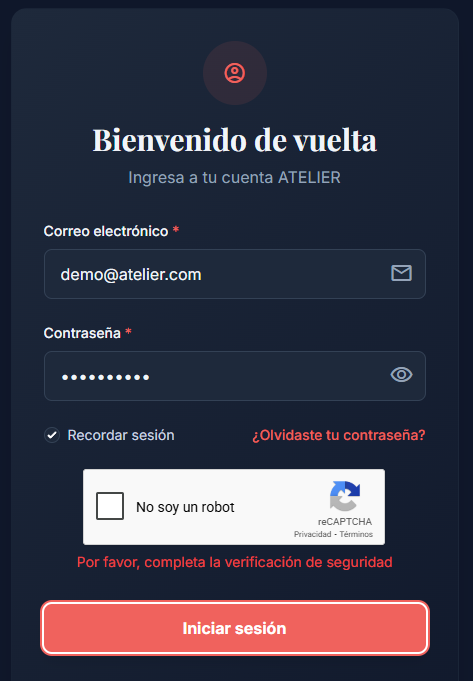

---


## 3. ¿CÓMO SE UTILIZAN?

### Registro - Validación en Tiempo Real

Los eventos que disparan la validación son blur cuando el usuario sale del campo, input mientras escribe si ya mostró un error anteriormente, y change en los checkboxes.

El comportamiento sigue este flujo: el usuario escribe en un campo, al salir del campo con blur se valida inmediatamente. Si hay error, aparece un mensaje en rojo debajo del campo y el borde del campo se marca en rojo. El botón "Crear cuenta" permanece deshabilitado hasta que todos los campos sean válidos. Cuando todo es válido, al hacer clic se redirige a login.html después de una breve animación.

### Login - Validación con reCAPTCHA

El flujo de validación comienza cuando el usuario ingresa email y contraseña, luego completa el reCAPTCHA haciendo clic en "No soy un robot" y finalmente hace clic en "Iniciar sesión".

El proceso de verificación primero comprueba si el reCAPTCHA está completado, si no lo está muestra un mensaje de error específico. Luego valida las credenciales contra el usuario demo. Si son correctas, muestra un toast de bienvenida y redirige a index.html después de un segundo. Si son incorrectas, muestra un mensaje general de error debajo del campo de contraseña.

---

## 4. DISEÑO DETALLADO DE VALIDACIONES

### Registro - Estructura de Validación

El sistema mantiene un objeto formState que almacena el estado de validación de cada campo, con propiedades valid (booleano) y message (string). Los campos incluidos son firstName, lastName, email, phone, password, confirmPassword, humanVerification, terms y privacy, siendo este último siempre válido por defecto.

La función validateField es la encargada de validar cada campo individualmente. Obtiene el valor del campo, aplica las validaciones según el tipo de campo, actualiza el formState correspondiente, muestra u oculta los mensajes de error visuales y finalmente actualiza el estado del botón de envío.

### Login - Validación de Credenciales

Se define un objeto VALID_USER con las credenciales del único usuario válido: email demo@atelier.com, contraseña Atelier123!, nombre Demo y apellido Usuario.

La función validateRecaptcha obtiene la respuesta del reCAPTCHA con grecaptcha.getResponse() y retorna true solo si existe y tiene contenido.

En el envío del formulario, primero se valida el reCAPTCHA. Si no está completo, se muestra el error correspondiente y se detiene el proceso. Si está completo, se validan las credenciales. Si coinciden con el usuario demo, se muestra éxito y se redirige a index.html. Si no coinciden, se muestra el error general.

### Indicador Visual de Fortaleza de Contraseña

El sistema calcula una puntuación de 0 a 4 basada en el cumplimiento de cuatro requisitos: longitud mínima de 8 caracteres, presencia de mayúscula, presencia de número y presencia de carácter especial.

Esta puntuación se mapea a cuatro niveles: Débil para puntuación 0 o 1, Regular para puntuación 2, Buena para puntuación 3 y Fuerte para puntuación 4. Cada nivel tiene una clase CSS específica que cambia el color y ancho de la barra de progreso, además de un texto descriptivo.


